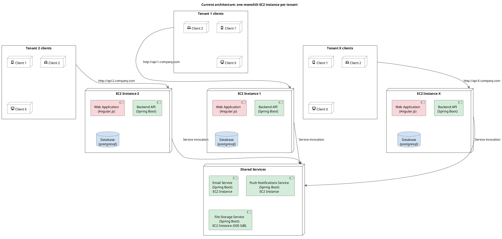
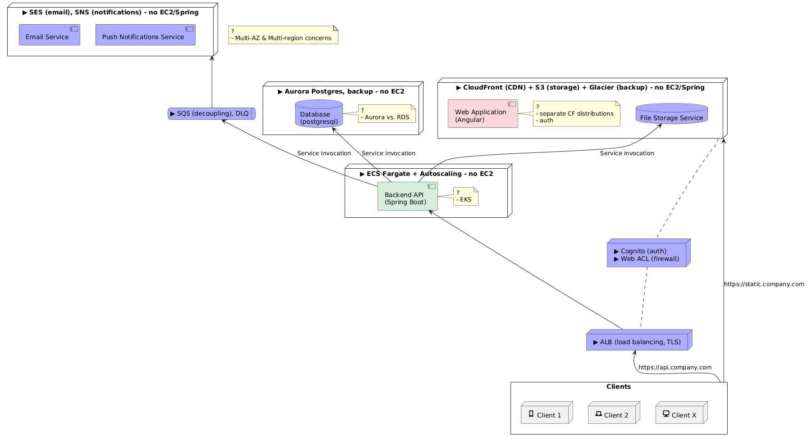

# Monolith Decomposition

## AWS Assignment

Your deliverable will be the base for further, in-depth technical discussion.

Look at the architecture in the diagram:

- List and explain the downsides of the architecture
- Create an alternative, scalable architecture diagram

Notes:

- Web applications and backend APIs use the same version for all EC2 instances
- For more tenants, another monolith instance is spun up and the associated users connect to it with a new API URL.

Additional concerns:

- What about the database backups and security?

Diagram:

## Deliverable

Maintenance burden:

- Spring Boot code is used for functionality which is not necessarily core to the mission: email, notifications, files (it seems like reinventing the wheel, and perhaps it is not cost effective)

Suboptimal resource utilization:

- Either app instances are the same but if customer/tenant size/load differ then some of the monolith instances are underutilized, or it leads to maintenance burden to tune each
- Even if instance is tuned to the customer/tenant then API and database loads will still have a different profile and observability will suffer from their cross-talk
- Heavy database queries can starve backend API and colocation of database and backend API make right-sizing impossible
- The diagram indicates no queue (tight coupling) with email & notification services
- Cost grows linearly with number of customers/tenants (while geographically distributed customers could be balanced better; and what if tenants would merge?)

Workforce fragmentation:

- Firefighting on different monolith instances (if tuned specifically to customer)

Coarse-grain scalability:

- What if file storage hits the cap?
- What if the database for one client hits the cap? Scaling for database would also mean scaling the instance for the backend API - is this really necessary?

Single points of failure:

- For a client accessing API there is only one EC2 instance for the monolith
- For the monoliths to access services there is only one EC2 instance for the service

Thus what I would propose instead is this:

<!-- podman run -i --rm -v $PWD:/w -w /w ghcr.io/plantuml/plantuml:latest -tpng -pipe < system-design/monolith-decomposition-2.plantuml > system-design/monolith-decomposition-2.png -->

Notes:

- Not included in the diagram but implicit: encryption at rest and in flight, secrets manager with automatic rotation.
- Added benefits of this decoupling: easier to introduce least privilege access scopes.
- The system now has two entry paths, static and API, so the firewall (Web ACL) is needed in front of CloudFront as well as the ALB.
- Assumption: auth does not appear anywhere in the original diagram, so it is presumed to sit inside the monolith.
- Backups: set the acceptable data loss and downtime first (nightly dumps vs continuous recovery; snapshot restore in hours vs a second cluster kept warm), then Aurora point-in-time recovery plus snapshot copies to a cross-account immutable vault (Vault Lock), S3 versioning and Object Lock for files, and a scheduled restore drill (untested backups fail when needed).
- Security: pick the tenant isolation model first (pooled with row-level security, tenant taken from the token and never from the request), then private subnets with IAM database auth instead of a static password, and separate accounts per environment with an immutable audit trail (CloudTrail) and threat detection (GuardDuty).

Order of monolith break-up:

- Given the storage volume and its traffic it might have the biggest cost impact on the bottom line (hence why first).
- Migrate to Aurora Postgres (Postgres to ease migration) and separate concerns between stateful & stateless. Heaviest in terms of complexity - migrate in waves, ensure row-level security; most benefits - more optimal load, gain insights into ops, better availability, better latency and storage decoupled from compute with Aurora. To derisk, perhaps one Aurora per tenant first and then merge.
- Decouple auth from the monolith (it is a task for Cognito), which finally allows to...
- Migrate backend from EC2 to ECS Fargate (incl. min. of hot instances, autoscaling, scaling caps).
- Migrate email & notifications (decoupled already so it can wait till the end and overall impact likely smallest), completing making the system async
- Each step needs its own cost comparison before committing, e.g. running ECS and maintaining the Spring Boot code vs paying for the managed service.

Questions:

- Go for ECS Fargate now, EKS only if outgrowing capacity of the new architecture
- ALB, Aurora, Fargate and S3 are multi-AZ-ready from day one; Expanding to multi-region would allow bigger files distributed closer to customers to reduce latency
- Separate CloudFront depending on what requires auth (e.g. if frontend contains intellectual property, e.g. domain specific web rendering), and then the auth type depends on that
- Aurora vs. RDS: Aurora for better latency with geographically spread customers, but it is more expensive, so depending on data volume RDS may be the better choice
- Other: consider caching the frequently accessed data or API responses

## Questions & Answers

Asked during the presentation of the above.

**Once the frontend and backend are decoupled, how do you handle version skew? Autoscaling means many instances at different stages of deployment, and a client may call an endpoint that is new or already gone (concretely: ~1000 customers, so ~1000 pods).**

- Let multiple backend versions coexist and pin each frontend version to the backend API version it was built against, so an already loaded UI keeps talking to its own version.
- Alternatively route by version (separate clusters/target groups), which is also what canary and A/B deployments need.
- The cost is maintaining several versions at once, so old ones still need a retirement window rather than being kept indefinitely.

**Follow-up: that is easy for the engineer, but with six deploys a day a user who has the UI open all day gets punished. Is that acceptable?**

- It is not, and it does not have to be: the old frontend keeps calling the backend version it was pinned to, so the open session is not broken by a deploy. Only a genuinely stale session (a UI left open for days) hits the retirement window.

**Follow-up: what if a migration on Aurora/RDS has dropped something the older backend still uses?**

- Never a big bang change. Multi-stage instead: add the new columns, backfill existing rows in a staggered fashion (there can be a lot of data), make the code handle both shapes, and only drop the old column once the version using it is retired.
- The same applies to long-running tasks that are already in flight, so this is needed even when no user session is involved.

**What would you monitor in this architecture?**

- Monitoring everything is easy to say, so prioritise what threatens availability first.
- Cluster capacity and how it fluctuates across the day.
- SQS queue length.
- Database capacity against thresholds, not only hard caps, including the point where it pushes into a different cost regime.
- Auth anomalies and load at the ALB (scanning, DDoS).
- CloudFront latency for files and the web application, since that is felt directly as user experience.
- Volume of push notifications and email against caps, and at what granularity that is worth paying for.
- Right-sizing: observed memory and compute, so instances are not overprovisioned.

**Blast radius: if the deployment runs under a single IAM role that can do everything, one mistake (a junior cleaning up a table they dislike) or one compromise reaches all customer data, so where are the layers of separation?**

Flagged as the next topic but the call ran out of time; this is the answer I would have given.

- One task role per service, scoped to specific bucket prefixes and queue ARNs, with permission boundaries so a role cannot be quietly widened.
- Tenant separation in the pooled database rests on row-level security being set per transaction and reset when the connection returns to the pool, and on the application not connecting as the table owner.
- Files are reached only through short-lived presigned URLs over per-tenant prefixes, with the bucket itself never directly reachable.
- No database password in the task definition at all: IAM database auth, or Secrets Manager injected at runtime.
- Restricted egress and VPC endpoints, so a compromised task cannot reach beyond the resources it serves.
- Against mistakes rather than attackers: a separate production account, no routine human access to production data, deletion protection, and the immutable backup vault above.

## Feedback

Received after the call, on the redesign:

- The diagram was strong, with the trade-offs behind each choice walked through and the shortcomings of the existing setup explained clearly.
- The alternative was considered a good one, taking security, scalability, observability and migration paths into account.
- The answer on monitoring came across as pragmatic, going straight to the things that actually matter to watch.
