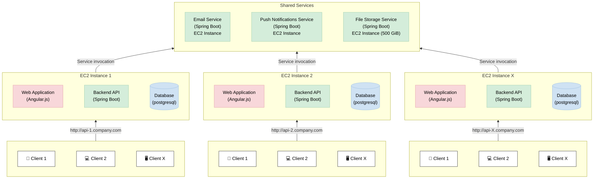
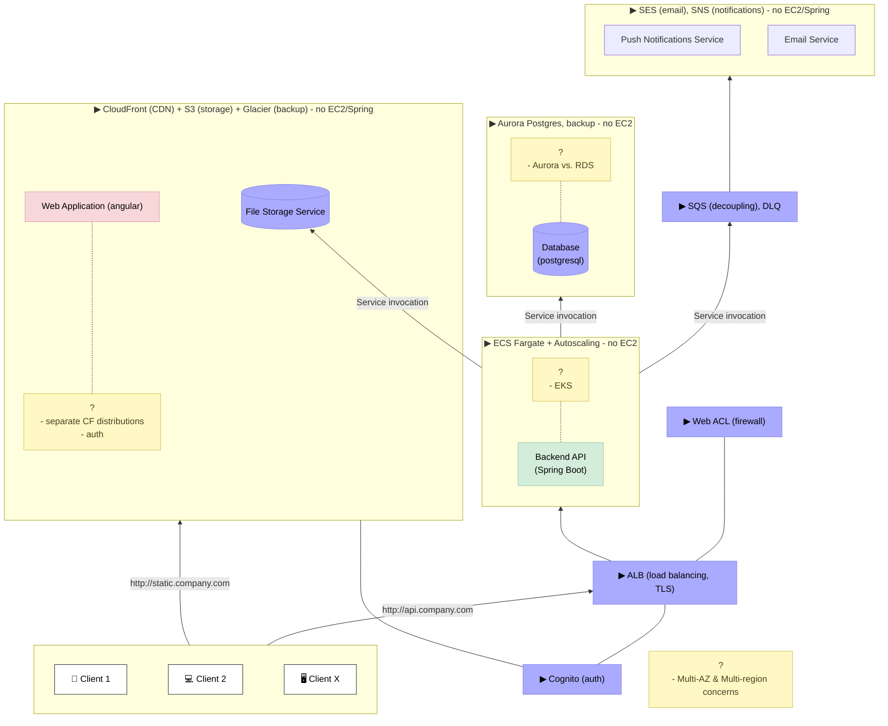

# Monolith Decomposition

## AWS Assignment

Your deliverable will be the base for further, in-depth technical discussion.

Look at the architecture in the diagram:

- List and explain the downsides of the architecture
- Create an alternative, scalable architecture diagram

Notes:

- Web applications and backend APIs use the same version for all EC2 instances
- For more tenants, another monolith instance is spun up and the associated users connect to it with a new API URL.

Additional concerns:

- What about the database backups and security?

Diagram:

## Deliverable

Maintenance burden:

- Spring Boot code is used for functionality which is not necessarily core to the mission: email, notifications, files (it seems like reinventing the wheel, and perhaps it is not cost effective)

Suboptimal resource utilization:

- Either app instances are the same but if customer/tenant size/load differ then some of the monolith instances are underutilized, or it leads to maintenance burden to tune each
- Even if instance is tuned to the customer/tenant then API and database loads will still have a different profile and observability will suffer from their cross-talk
- Heavy database queries can starve backend API and colocation of database and backend API make right-sizing impossible
- The diagram indicates no queue (tight coupling) with email & notification services
- Cost grows with number of customers/tenants (while geographically distributed customers could be balanced better; and what if tenants would merge?)

Workforce fragmentation:

- Firefighting on different monolith instances (if tuned specifically to customer)

Coarse-grain scalability:

- What if file storage hits the cap?
- What if the database for one client hits the cap? Scaling for database would also mean scaling the instance for the backend API - is this really necessary?

Single points of failure:

- For a client accessing API there is only one EC2 instance for the monolith
- For the monoliths to access services there is only one EC2 instance for the service

Thus what I would propose instead is this:

Notes:

- Not included in the diagram but implicit: encryption at rest and in flight, secrets manager with automatic rotation.
- Added benefits of this decoupling: easier to introduce least privilege access scopes.

Order of monolith break-up:

- Given the storage volume and its traffic it might have the biggest cost impact on the bottom line (hence why first).
- Migrate to Aurora Postgres (Postgres to ease migration) and separate concerns between stateful & stateless. Heaviest in terms of complexity - migrate in waves, ensure row-level security; most benefits - more optimal load, gain insights into ops, better availability, better latency and storage decoupled from compute eith Aurora. To derisk, perhaps one Aurora per tenant first and then merge.
- Decouple auth from the monolith (it is a task for Cognito), which finally allows to...
- Migrate backend from EC2 to ECS Fargate (incl. min. of hot instances, autoscaling, scaling caps).
- Migrate email & notifications (decoupled already so it can wait till the end and overall impact likely smallest), completing making the system async

Questions:

- Go for ECS Fargate now, EKS only if outgrowing capacity of the new architecture
- ALB, Aurora, Fargate and S3 are multi-AZ-ready from day one; Expanding to multi-region would allow bigger files distributed closer to customers to reduce latency
- Separate CloudFront depending on what requires auth (e.g. if frontend contains intelectual property, e.g. domain specific web rendering), and then the auth type depends on that
- Aurora vs. RDS - see above
- Other: consider caching the frequently accessed data or API responses
