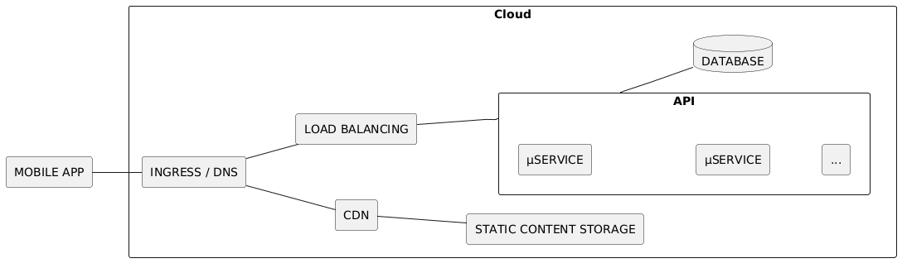
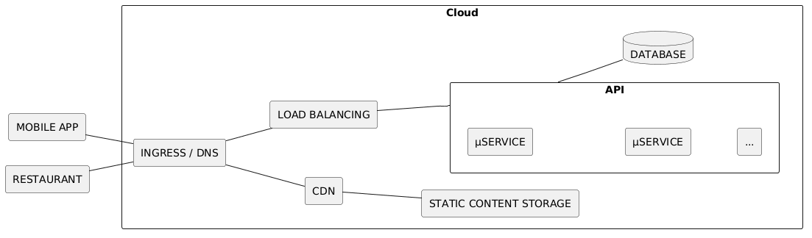
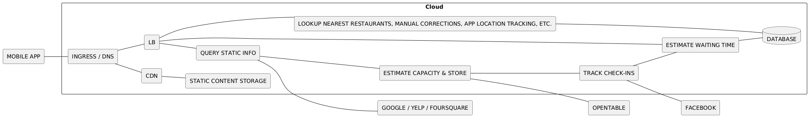
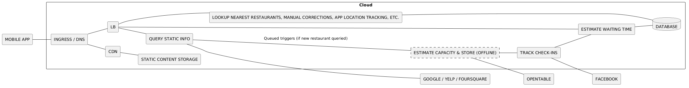
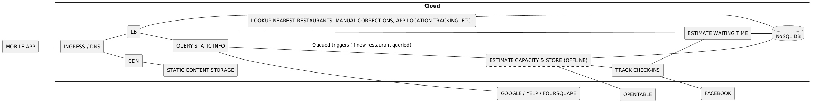
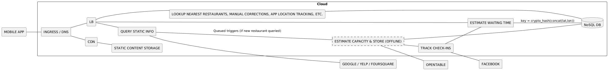
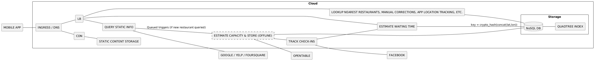
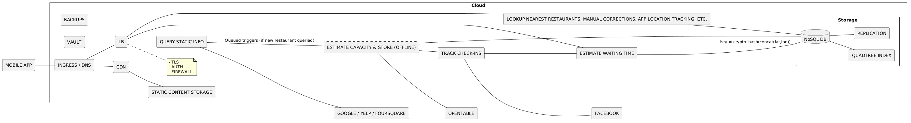

# SYSTEM DESIGN INTERVIEW

## Waiting Time in Neighboring Restaurants

---

**GOAL**

Design a service which for a user at a physical location will suggest N nearest restaurants, each listed with a waiting time

**NOTE**

I encountered a variation of this system design assignment during on-site interviews at Amazon and Facebook

---

**INITIAL SKETCH OF TOP-LEVEL ARCHITECTURE**

<!-- podman run -i --rm -v $PWD:/w -w /w ghcr.io/plantuml/plantuml:latest -tpng -pipe < system-design/restaurant-waiting-time-1.plantuml > system-design/restaurant-waiting-time-1.png -->

But this leaves some questions to be answered...

---

**QUESTION 1**

How do we obtain waiting times?

**ANSWER 1A**

We provide an API for the restaurants and enrolled restaurants will provide the information

---

**RESTAURANT INFORMATION**

- Restaurant location, opening times & capacity
- Current number of guests
- Current number of waiting guests
- This allows to calculate: average eating time
- And it allows to: estimate waiting time

---

**INITIAL SKETCH OF TOP-LEVEL ARCHITECTURE**

<!-- podman run -i --rm -v $PWD:/w -w /w ghcr.io/plantuml/plantuml:latest -tpng -pipe < system-design/restaurant-waiting-time-2.plantuml > system-design/restaurant-waiting-time-2.png -->

It would be extended with an interface towards the restaurants...

---

**BUT WE CAN DO BETTER**

**ANSWER 1B**

Automate data collection and prepopulate database with estimates

---

**QUERY FOR STATIC RESTAURANT INFO**

- Restaurant location and opening times can be queried from APIs of Google / Yelp / Foursquare / Facebook or scraped from the internet (last resort)
- Capacity of a restaurant can be inferred by tracking number of auto check-ins on Facebook API and correlating with the moment when there are no more tables available on OpenTable API
- Our app should allow users to submit corrections of that location information and capacity estimates

---

**ESTIMATING APPROXIMATE WAITING TIME**

- The average time of stay can be pulled from statistical records (ranked by restaurant types)
- Capacity, average time of stay, check-ins would then allow to estimate the waiting time
- Since the margin of error would be high the approximate waiting time would be presented in tiered ranges: couple of/10-20/20-40/40-60 minutes

---

**IMPROVING ACCURACY OF WAITING TIME**

- Anonymized tracking of the time on restaurant premises by the app would further contribute to improving the accuracy over time
- As the app gains in popularity the app tracking would dominate as a data source

---

**REVISED ARCHITECTURE**

<!-- podman run -i --rm -v $PWD:/w -w /w ghcr.io/plantuml/plantuml:latest -tpng -pipe < system-design/restaurant-waiting-time-3.plantuml > system-design/restaurant-waiting-time-3.png -->

---

**QUESTION 2**

How will we ensure scalability?

**ANSWER 2**

Throttle most frequent third-party API requests, cache replies, shard database

---

**REVISED ARCHITECTURE**

<!-- podman run -i --rm -v $PWD:/w -w /w ghcr.io/plantuml/plantuml:latest -tpng -pipe < system-design/restaurant-waiting-time-4.plantuml > system-design/restaurant-waiting-time-4.png -->

Enqueue requests for estimating capacity for newly added restaurants (and process them offline)

---

**REVISED ARCHITECTURE**

<!-- podman run -i --rm -v $PWD:/w -w /w ghcr.io/plantuml/plantuml:latest -tpng -pipe < system-design/restaurant-waiting-time-5.plantuml > system-design/restaurant-waiting-time-5.png -->

Persistently cache the static results of third-party APIs, store the calculated estimates

---

**REVISED ARCHITECTURE**

<!-- podman run -i --rm -v $PWD:/w -w /w ghcr.io/plantuml/plantuml:latest -tpng -pipe < system-design/restaurant-waiting-time-6.plantuml > system-design/restaurant-waiting-time-6.png -->

Use a highly scalable, sharded NoSQL database

---

**QUESTION 3**

What would be the key?

**ANSWER 3**

The key would be based on geographical location, cryptographically hashed to spread the load

---

**REVISED ARCHITECTURE**

<!-- podman run -i --rm -v $PWD:/w -w /w ghcr.io/plantuml/plantuml:latest -tpng -pipe < system-design/restaurant-waiting-time-7.plantuml > system-design/restaurant-waiting-time-7.png -->

Concatenated latitude and longitude as key, cryptographically hashed to prevent lopsided shards

---

**QUESTION 4**

What about the organization of the storage to look-up nearest restaurants?

**ANSWER 4**

Use a quadtree (superimposed over a world map) as an index to facilitate searching for the nearest restaurants.

---

**REVISED ARCHITECTURE**

<!-- podman run -i --rm -v $PWD:/w -w /w ghcr.io/plantuml/plantuml:latest -tpng -pipe < system-design/restaurant-waiting-time-8.plantuml > system-design/restaurant-waiting-time-8.png -->

Adjacent to the database, there would be a quadtree-based index

---

**IN-DEPTH INFO ABOUT QUADTREES**

- Point quadtrees are, in a way, a generalization of binary search to 2D
- [https://en.wikipedia.org/wiki/Quadtree](https://en.wikipedia.org/wiki/Quadtree)
- [https://ericandrewlewis.github.io/how-a-quadtree-works/](https://ericandrewlewis.github.io/how-a-quadtree-works/)

---

**QUADTREE SCALABILITY**

- Look-up of nearest restaurants is the most frequent operation in the system
- Let us assume that there is 1 restaurant for every 1000 people (probably an overestimation)
- Then, with 8 billion people there are 8 million restaurants
- Also assuming 1 kiB data per restaurant (an overestimate for data structure overhead and hash key identifying a restaurant)
- We arrive at ~8 GiB index size which easily fits in RAM and thus enables low latency serving

---

**QUESTION 5**

What can fail? How to handle failures?

**ANSWER 5**

- Static data storage failures: Cold-storage backup for the static content and persistent cache
- Dynamic data storage failures: Read-optimized shard replication
- Computing instance failures: Multiple instances of microservices (behind the load balancer)

---

**QUESTION 6**

What about the security?

**ANSWER 6**

- HTTPS, user authentication
- DDoS defence, application firewall
- Service access credential vault, minimal access roles
- Restaurant API/interface to prevent spoofing competition

---

**REVISED ARCHITECTURE**

<!-- podman run -i --rm -v $PWD:/w -w /w ghcr.io/plantuml/plantuml:latest -tpng -pipe < system-design/restaurant-waiting-time-9.plantuml > system-design/restaurant-waiting-time-9.png -->

---

**RELATED MATERIALS**

- [Jackson Gabbard - Intro to Architecture and Systems Design - Interviews](https://youtu.be/ZgdS0EUmn70)
- [Hired in Tech - System Design](https://www.hiredintech.com/system-design)
- [Facebook Blog - Under the Hood: Building the Location API](https://code.fb.com/core-data/under-the-hood-building-the-location-api/)

---

**THANK YOU**
